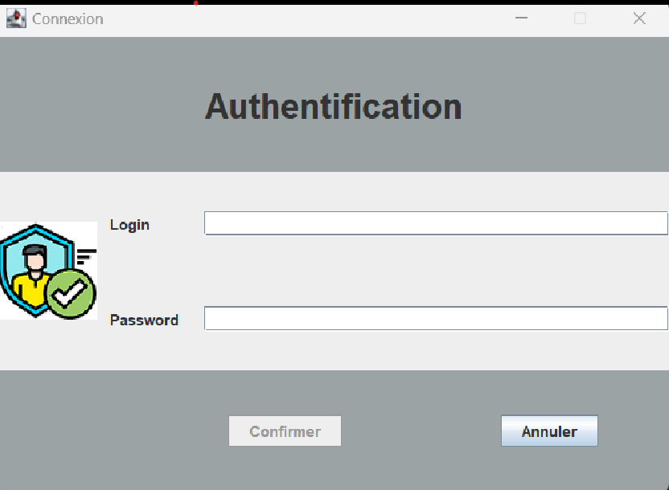
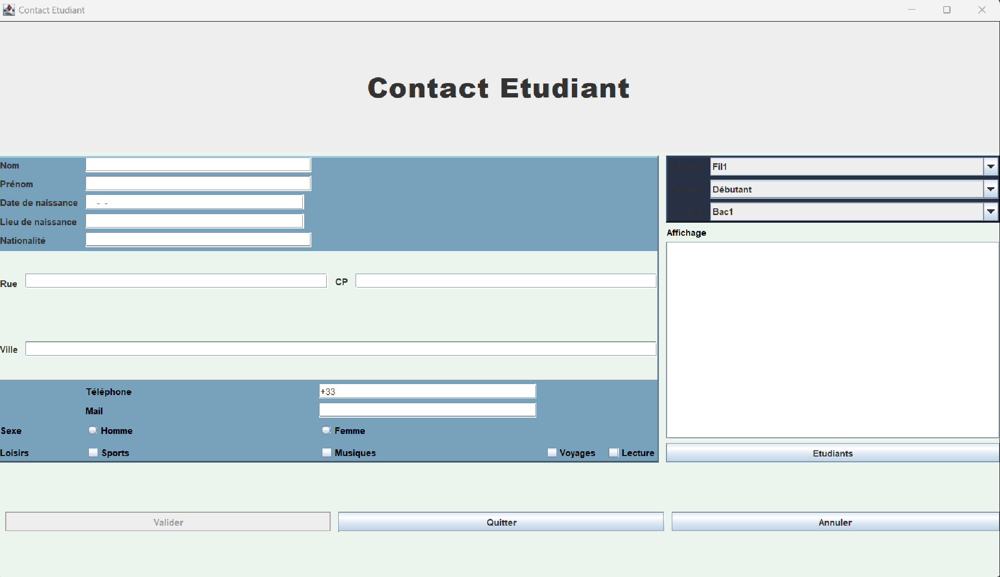
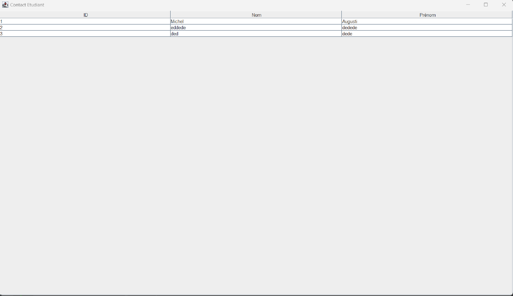

= BDDGraph documentation

==== Exemples d'utilisation et fonctionnement

:author:Pagezy Gauthier +
:email:gauthier.pagezy@esme.fr +
:revdate: 21 Mars 2023 +
:revnumber: 1.0.0 +
:jdkversion: 19.0.2 +

----
L'application Contact Etudiant permet la sauvegarde numérique des informations de l'étudiant.
Son développement suit le modèle MVC.
----

== Condition d'utilisation
L'étudiant ne peut pas avoir plus de 80 ans ni moins de 10 ans. Vérifiez que les champs non concernés
par des chiffres n'en contiennent pas. Le code postal doit être au format Français.
La politique des champs oblitoire et de leur format est à définir dans la classe CandidatEtudiantController.

WARNING: Si oubli du nom d'utilisateur ou du mot de passe, contactez l'administrateur.

==== Première page
****

La première page vous servira à vous connecter et ainsi accéder formulaire de création de l'étudiant.

CAUTION:  *"Vérifiez la connexion internet"* : Problème de connexion au service de base
de donnée, vérifiez votre connexion et réésayez. Si l'erreur persiste, contactez l'administrateur.
*"Login ou mot de passe incorrect"* : Vérifiez vos informations de connection. Si l'erreur persiste, contactez l'administrateur.
****

==== Seconde page
****

La seconde page constitue le formulaire d'enregistrements des informations de l'étudiant.
Les informations doivent correspondrent aux conditions d'utilisation pour pouvoir être enregistrées
dans la base.
****

==== Page Afficher étudiants
****

Affichage des étudiants option de tri, séléction et recherche disponible dans les prochaines versions.
****

